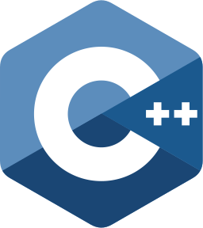
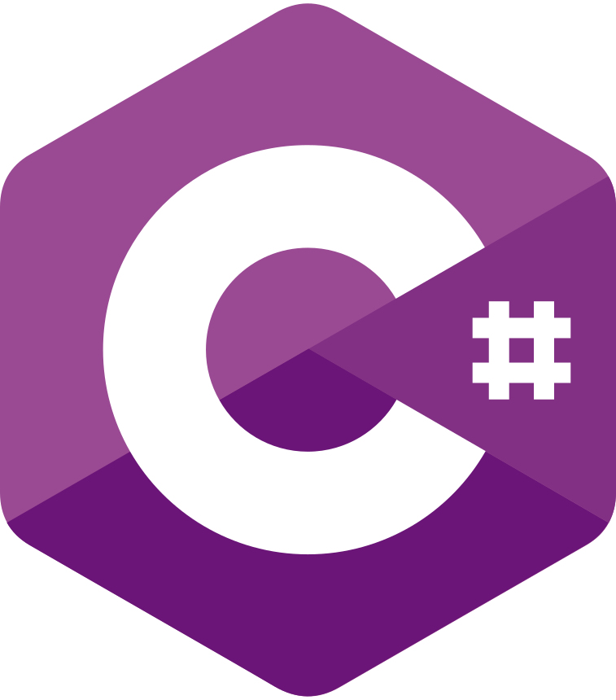

# [ Work in progress !!! ]

Stats
---

  

## 🛠️ My Skills

### 👨‍💻 Programming languages (still learning) &emsp;&emsp;&emsp;&emsp;&emsp;&emsp;&emsp;&emsp;&emsp;// and html + css ツ

  
  
  
  
  
  
  
  
  
  

 
 

### 💻 Software

  
  
  
  
  
  

 
 

### ⚙ Operating systems

  
  
  
  
  

 
 

<h2 align="center">Contact me?</h2>

yannic.studer@protonmail.com <a href="mailto:yannic.studer@protonmail.com">↗</a>

  
   
  Bye

<!--- END -->
