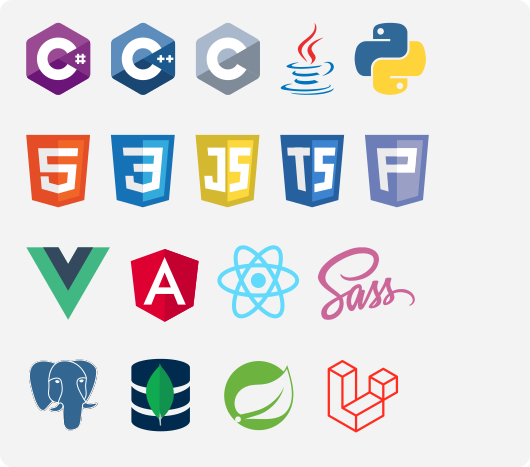
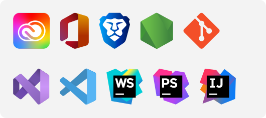
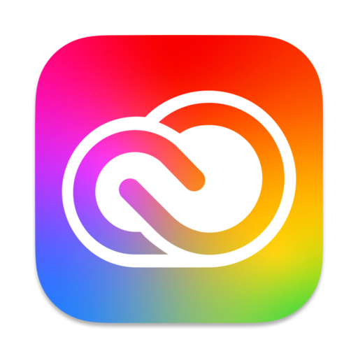

 

## I'm Yannic 👋🏻

A motivated student and developer who enjoys helping other people, highly interested in computers and security.

[ Work in progress !!! ]

## My Website

  

## Stats

  

<!--
- https://jakearchibald.github.io/
- SVG Minify / cleaner
-->

## 🛠️ My skills and interests

### 👨‍💻 Programming languages (still learning) &emsp;&emsp;&emsp;&emsp;&emsp;&emsp;// and html + css ツ

  
  
  <!--
  //old way, not responsive...
  
  
  
  
  
  
  
  
  
  
  
  -->

 
 

### 💻 Software

  

  <!--
  
  
  
  
  
  
  -->

 
 

### ⚙ Operating systems

  

  <!--
  
  
  
  
  
  -->

 
 

<h2 align="center">Contact me?</h2>

yannic.studer@protonmail.com <a href="mailto:yannic.studer@protonmail.com">↗</a>

  

<!--- END -->
